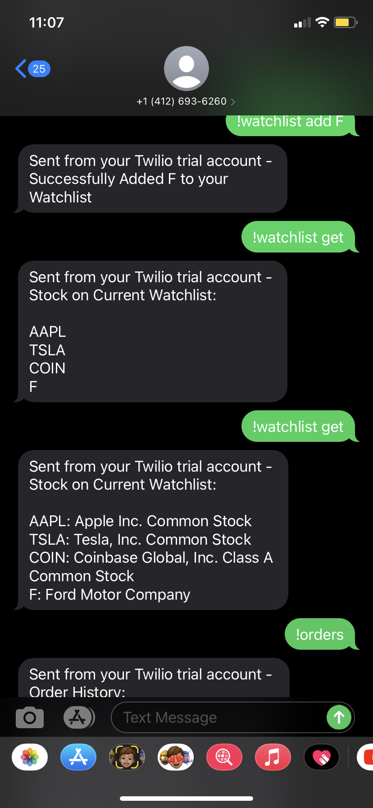

# SMS-Bot

Python SMS Bot created using Twilio API and Alpaca API to trade stocks through text messages

# List of Commands
* ```!commands```
* ```!account```
* ```!quote [stock symbol]```
* ```!buy [stock symbol] [quantity] [limit] [limit price]```
* ```!sell [stock symbol] [quantity]```
* ```!positions```
* ```!orders```
* ```!change```
* ```!watchlist get```
* ```!watchlist add```
* ```!timeopen```
* ```!timeclose```

# Example of Interactions
<p align="center">
  
</p>
